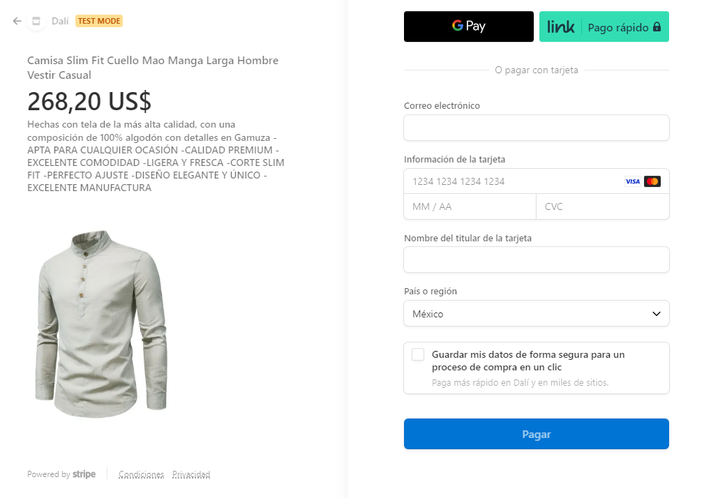

Marketplace es una aplicación donde puedes publicar y comprar articulos(dark mode incluido)

<h1 align="center">Características</h1>

<ul>

<li >Dashboard 
 

 En el dashboard podemos encontrar todos los productos creados por los usuarios con su título, precio y nombre del creador.
</li>
 

<li >Ver Producto 
 

 En ver producto encontraremos los mismos datos que en el dashboard con la diferencia de no tener límite de longitud en el título al igual que la descripción del producto.
</li>
 

<li>Comprar Producto 
 Para realizar las compras ase utilizo el sdk de <a href="https://stripe.com/docs/payments/accept-a-payment">Stripe</a>.
</li>
 

<li>Agregar Producto 
 Formulario para poder agrear el producto.
</li>
 

<li>Editar y Borrar Producto 
 
 Cuando eres el creador del producto podras editarlo y borrarlo, esta opcion sera un icono de tres puntos que podremos encontrar en ver producto.
</li>
 

<ul>

